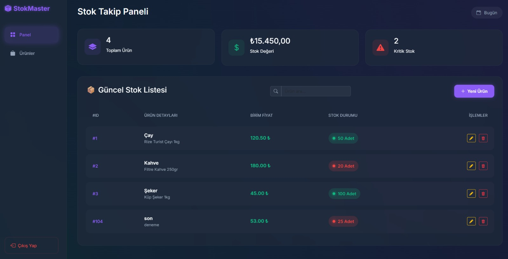

# 📦 StokMaster Pro - Kurumsal Stok Takip Sistemi


StokMaster Pro, modern işletmeler için geliştirilmiş; güvenli, hızlı ve kullanıcı dostu bir stok yönetim panelidir. **Spring Boot** altyapısı ile güçlendirilmiş Backend ve **Modern CSS/JS** ile tasarlanmış "Dark Mode" arayüzü sayesinde profesyonel bir deneyim sunar.

---

## 🚀 Proje Özellikleri

### 🔒 Güvenlik & Erişim
* **Spring Security Entegrasyonu:** Yetkisiz erişimleri engelleyen güvenli giriş sistemi.
* **Özelleştirilmiş Login Sayfası:** Glassmorphism tasarımlı, şık giriş ekranı.
* **Güvenli Çıkış (Logout):** Oturumu sonlandırma mekanizması.

### 📦 Stok Yönetimi (CRUD)
* **Ürün Ekleme:** Dinamik modal pencereler ile sayfa yenilenmeden ürün ekleme.
* **Listeleme:** Tüm stok durumunu, kritik seviyeleri ve fiyatları tek tabloda görme.
* **Güncelleme:** Ürün bilgilerini anlık olarak düzenleme imkanı.
* **Silme:** SweetAlert2 ile güçlendirilmiş, onay mekanizmalı güvenli silme işlemi.

### ⚡ Akıllı Özellikler
* **Canlı İstatistikler:** Toplam ürün sayısı, stok değeri ve kritik stok uyarılarının anlık hesaplanması.
* **Anlık Arama (Instant Search):** Backend'e istek atmadan, JavaScript ile milisaniyeler içinde ürün filtreleme.
* **Kalıcı Veritabanı:** H2 Database (File Mode) sayesinde veriler bilgisayar kapansa bile korunur.

### 🎨 Arayüz (UI/UX)
* **Neon Dark Mode:** Göz yormayan, modern karanlık tema.
* **Responsive Tasarım:** Bootstrap 5 ile her ekrana uyumlu yapı.
* **SweetAlert2 Bildirimleri:** Kullanıcı etkileşimleri için modern pop-up uyarıları.

---

## 🛠️ Teknolojiler

| Alan | Teknoloji |
|---|---|
| **Backend** | Java 17, Spring Boot, Spring Data JPA |
| **Frontend** | HTML5, CSS3 (Custom), JavaScript (Vanilla), Bootstrap 5 |
| **Database** | H2 Database (File Based Storage) |
| **Security** | Spring Security |
| **Build Tool** | Maven |

---

## 📸 Ekran Görüntüleri

### Giriş Ekranı
Modern ve güvenli giriş sayfası.


### Yönetim Paneli
Anlık stok durumunu gösteren ana panel.

> **Not:** Proje yerel sunucuda (Localhost) çalışmaktadır.

---

## ⚙️ Kurulum ve Çalıştırma

Projeyi bilgisayarınızda çalıştırmak için:

1.  Repoyu klonlayın:
    ```bash
    git clone [https://github.com/burakaltinbicak/StokMaster-Pro.git](https://github.com/KULLANICI_ADINIZ/StokMaster-Pro.git)
    ```
2.  Proje dizinine gidin ve Maven ile bağımlılıkları yükleyin.
3.  `StokTakipApplication.java` dosyasını çalıştırın.
4.  Tarayıcıda şu adrese gidin: `http://localhost:8080`
5.  **Giriş Bilgileri:**
    * Kullanıcı Adı: `babu`
    * Şifre: `1234`

---

## 🗺️ Gelecek Güncellemeler (Roadmap)

* [ ] **Detaylı Takvim:** Ürün giriş-çıkış tarihlerinin takvim üzerinde görüntülenmesi.
* [ ] **Kategori Sistemi:** Ürünleri kategorilere (Elektronik, Gıda vb.) ayırma.
* [ ] **Profil Sayfası:** Kullanıcı bilgilerini güncelleme ekranı.
* [ ] **Raporlama:** Stok hareketlerinin PDF/Excel olarak çıktısını alma.

---

👨‍💻 **Geliştirici:** Müslüm Burak Altunbıçak  
📧 **İletişim:** https://www.linkedin.com/in/brkbrk